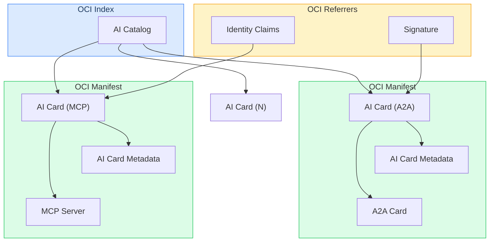

# AI Card Specification

**Version**: 1.0
**Status**: Draft
**Authors**: AI Card contributors

---

## Abstract

This specification defines an OCI-native format for representing, publishing and distributing AI Cards. An AI Card is an OCI Image Manifest that carries common AI agent metadata as its config and a single protocol-specific card as its layer. The AI Catalog is a collection of AI Cards represented as an OCI Image Index. The specification also defines application-layer support focusing on common use cases like signing and attestation using OCI Referrers API.

Refer to [examples](examples/README.md) for a simple reference implementation of the specification captured in this document.

---

## 1. Related Work

- **[CNCF ModelPack](https://github.com/modelpack/model-spec)** follows the OCI-native approach but targets AI models rather than AI agents and services to enable model usage and distribution through OCI.
- **[AGNTCY DIR](https://spec.dir.agntcy.org)** follows the OCI-native approach and describes agents and their capabilities as OCI artifacts but focuses on discovery and routing between AI agents rather than their internals.

---

## 2. Conformance

The key words "MUST", "MUST NOT", "REQUIRED", "SHALL", "SHALL NOT", "SHOULD", "SHOULD NOT", "RECOMMENDED", "MAY", and "OPTIONAL" in this document are to be interpreted as described in [RFC 2119](https://www.rfc-editor.org/rfc/rfc2119).

An implementation is conformant with this specification if it satisfies the normative requirements applicable to its role (producer or consumer).

---

## 3. Scope

This specification defines:

1. OCI Manifest structure for AI Card representation
2. Config Schema for common AI card metadata
3. Layer Schema for protocol cards
4. OCI Image Index structure for AI Catalog and discovery
5. Application-layer support via OCI Referrers (e.g. signing and attestation)
6. Conformance levels for gradual adoption

This specification does not define protocol internals (for example, A2A skills or MCP capabilities). Layer content schemas are owned by their respective upstream projects.

---

## 4. Design Goals

1. AI Cards are first-class OCI artifacts
2. Protocols are autonomous: each protocol project owns its own artifact schema and versioning
3. Discovery served through OCI Distribution API via AI Catalog
4. Signing and attestation are handled entirely via OCI Referrers
5. Content integrity is guaranteed by OCI content-addressable digests
6. Modularity and extensibility without circular dependencies or breaking changes

---

## 5. Data Model

The data model can be expressed using a MerkleDAG:
- AI Card is a node pairing common metadata with exactly one protocol-specific card
- AI Catalog is a node that aggregates multiple AI Cards for discovery
- Referrers are nodes linking external data to AI Cards for application-layer logic



### 5.1 AI Card

An AI Card is a standard OCI Image Manifest. It pairs common AI card metadata (config) with exactly one protocol-specific card (layer). Each protocol produces its own AI Card; a single agent supporting multiple protocols will have one AI Card per protocol, collected in an AI Catalog.

The following fields are normative:

- `schemaVersion`: MUST be `2`
- `mediaType`: MUST be `application/vnd.oci.image.manifest.v1+json`
- `artifactType`: MUST be `application/vnd.aaif.ai.card.v1+json`
- `config`: MUST point to the AI Card Metadata blob
  - `mediaType`: MUST be `application/vnd.aaif.ai.card.metadata.v1+json`
- `layers`: MUST contain exactly one layer descriptor for the protocol card
  - `artifactType`: MUST be one of:
    - `application/vnd.a2a.card.v1+json`: A2A protocol card
    - `application/vnd.mcp.card.v1+json`: MCP protocol card
    - `application/vnd.agntcy.dir.record.v1+json`: AGNTCY DIR record
    - `application/vnd.cncf.model.manifest.v1+json`: ModelPack manifest
    - any other relevant type
- `annotations`: MUST include:
  - `org.aaif.ai.card.id`: globally unique URI identifying the subject
  - `org.aaif.ai.card.specVersion`: the version of this specification, e.g. `"1.0"`
- `subject`: MAY be used to link a common subject to enable autodiscovery (see *Section 6.3*)

Example:

```json
{
  "schemaVersion": 2,
  "mediaType": "application/vnd.oci.image.manifest.v1+json",
  "artifactType": "application/vnd.aaif.ai.card.v1+json",
  "config": {
    "mediaType": "application/vnd.aaif.ai.card.metadata.v1+json",
    "digest": "sha256:<metadata-blob-digest>",
    "size": 342
  },
  "layers": [
    {
      "mediaType": "application/vnd.a2a.card.v1+json",
      "artifactType": "application/vnd.a2a.card.v1+json",
      "digest": "sha256:<a2a-blob-digest>",
      "size": 1060
    }
  ],
  "annotations": {
    "org.aaif.ai.card.id": "did:example:agent-finance-001",
    "org.aaif.ai.card.specVersion": "1.0",
    "org.opencontainers.image.title": "Acme Finance Agent",
    "org.opencontainers.image.created": "2026-02-22T16:00:00Z",
    "org.opencontainers.image.vendor": "Acme Financial Corp",
    "org.aaif.ai.discovery.domain": "finance",
    "org.aaif.ai.discovery.a2a.skill": "stock-analysis"
  }
}
```

### 5.2 AI Card Metadata

The AI Card Metadata is the OCI config blob of an AI Card. It carries common identity and publisher information shared across all protocol cards for the same agent.

The config blob MUST include:

- `id`: globally unique URI for the subject, such as a DID or URN. MUST match `org.aaif.ai.card.id` in the manifest annotations (see *Section 8*)
- `name`: human-readable name
- `description`: concise description
- `publisher.id`: globally unique publisher URI
- `publisher.name`: human-readable publisher name

The config blob MAY include:

- `logoUrl`: URI pointing to a logo image for the AI card
- `tags`: array of keywords describing the AI card

Example:

```json
{
  "id": "did:example:agent-finance-001",
  "name": "Acme Finance Agent",
  "description": "Executes finance workflows through multiple protocol adapters.",
  "logoUrl": "https://acme-finance.com/logo.png",
  "tags": ["finance", "trading"],
  "publisher": {
    "id": "did:example:org-acme",
    "name": "Acme Financial Corp"
  }
}
```

### 5.2.1 Authoring Workflow (Non-normative)

Authoring is intended to be human-friendly and tooling-driven. Producers SHOULD author the AI Card metadata and the protocol-specific card document as plain JSON files. Tooling wraps them into one OCI Manifest (AI Card) per protocol and collects all AI Cards into the AI Catalog (OCI Index). Digests, sizes, and descriptor wiring MUST be computed by tooling; producers MUST NOT hand-edit OCI manifests or indexes.

Typical authoring inputs:

- `ai-card-metadata.json` (the shared config blob, same for all protocol cards of one agent)
- `a2a-card.json`, `mcp-card.json`, or other protocol card documents (one per AI Card)

### 5.3 AI Card Protocol Layer

Each AI Card carries exactly one protocol card as its single OCI layer. The content schema for each layer type is defined and owned by the respective upstream project. This specification defines only the `artifactType` identifier and the governing project reference.

- A2A Card (`application/vnd.a2a.card.v1+json`): Content is an A2A agent card JSON document as defined by the [A2A specification](https://github.com/a2aproject/A2A).
- MCP Card (`application/vnd.mcp.card.v1+json`): Content is an MCP server info document as defined by the [Model Context Protocol specification](https://spec.modelcontextprotocol.io).
- AGNTCY Card (`application/vnd.agntcy.dir.record.v1+json`): Content is an AGNTCY DIR record document defined by the [AGNTCY DIR specification](https://spec.dir.agntcy.org/).
- ModelPack Card (`application/vnd.cncf.model.manifest.v1+json`): Content is an OCI Manifest as defined by the [CNCF ModelPack specification](https://github.com/modelpack/model-spec).

### 5.4 AI Catalog

An AI Catalog is a standard OCI Image Index. It serves two distinct roles:

**User‑facing** — what publishers and consumers interact with directly:

- The authoring inputs are the AI Card metadata and protocol card files (A2A, MCP, etc). Producers write these plain JSON files; tooling compiles one AI Card manifest per protocol.
- The card `id`, publisher identity, and optional discovery labels (see *Section 6.2.1*) are the fields intended for human-authored input, search, and ranking.
- Discovery APIs can serve a lightweight representation derived from catalog annotations without exposing the full OCI structure.

**Internal** — OCI machinery managed entirely by tooling, not hand‑edited:

- The OCI Image Index and Manifest JSON structures, including digests, sizes, and descriptor wiring.
- Referrers for signatures, attestations, and other append-only metadata.
- Registry storage layout (blobs, manifests, index files).

An AI Catalog is a standard OCI Image Index with:

- `schemaVersion`: MUST be `2`
- `mediaType`: MUST be `application/vnd.oci.image.index.v1+json`
- `artifactType`: MUST be `application/vnd.aaif.ai.catalog.v1+json`
- `manifests`: list of OCI descriptor entries, one per AI Card
  - `mediaType`: MUST be `application/vnd.oci.image.manifest.v1+json`
  - `artifactType`: MUST be `application/vnd.aaif.ai.card.v1+json`
  - `annotations`: SHOULD include:
    - `org.aaif.ai.card.id`: subject identifier
- `annotations`: MAY include OCI annotations for catalog-level metadata

Example:

```json
{
  "schemaVersion": 2,
  "mediaType": "application/vnd.oci.image.index.v1+json",
  "artifactType": "application/vnd.aaif.ai.catalog.v1+json",
  "manifests": [
    {
      "mediaType": "application/vnd.oci.image.manifest.v1+json",
      "artifactType": "application/vnd.aaif.ai.card.v1+json",
      "digest": "sha256:<a2a-card-digest>",
      "size": 618,
      "annotations": {
        "org.opencontainers.image.title": "Acme Finance Agent (A2A)",
        "org.aaif.ai.card.id": "did:example:agent-finance-001"
      }
    },
    {
      "mediaType": "application/vnd.oci.image.manifest.v1+json",
      "artifactType": "application/vnd.aaif.ai.card.v1+json",
      "digest": "sha256:<mcp-card-digest>",
      "size": 586,
      "annotations": {
        "org.opencontainers.image.title": "Acme Finance Agent (MCP)",
        "org.aaif.ai.card.id": "did:example:agent-finance-001"
      }
    }
  ],
  "annotations": {
    "org.opencontainers.image.title": "Acme Services Inc.",
    "org.opencontainers.image.created": "2026-02-22T16:00:00Z"
  }
}
```

---

## 6. Distribution

An AI Catalog MAY be served from any OCI-compliant registry or a statically hosted registry at `/.well-known/ai-registry`. Consumers MAY fetch the catalog, enumerate available AI Cards, and retrieve individual manifests and blobs as needed.

The registry MUST support the following subset of the [OCI Distribution Specification](https://github.com/opencontainers/distribution-spec) read endpoints:

| Method | Full Path | Description |
|---|---|---|
| `GET` | `/.well-known/ai-registry` | Version check - return `{}` with `200 OK` |
| `GET` | `/.well-known/ai-registry/_catalog.json` | List available repository names (AI Catalogs) |
| `GET` / `HEAD` | `/.well-known/ai-registry/<name>/blobs/<digest>` | Fetch or check a blob by digest |
| `GET` / `HEAD` | `/.well-known/ai-registry/<name>/manifests/<reference>` | Fetch or check a manifest by tag or digest |
| `GET` | `/.well-known/ai-registry/<name>/tags/list` | List available tags |
| `GET` | `/.well-known/ai-registry/<name>/referrers/<digest>` | List referrers for a given digest |
| `GET` | `/.well-known/ai-registry/<name>/referrers/<digest>?artifactType=<type>` | Filtered referrer listing |

#### 6.1 Publication Workflow

Producers MUST be able to publish AI Cards to any OCI-compliant registry (local filesystem or remote webserver) using the OCI Distribution Specification. Publication workflow MAY be private or public depending on the access controls defined by the registry owner.

**Publication workflow:**

1. Push each AI Card (OCI Manifest) with its metadata config and protocol layer
2. Optionally create an AI Catalog (OCI Image Index) referencing multiple AI Cards

#### 6.2 Discovery Workflow

Consumers MUST be able to discover and retrieve AI Cards using the OCI Distribution Specification.

**Discovery workflow:**

1. Fetch `GET /.well-known/ai-registry/_catalog.json` to obtain the list of repository names
2. For each repository `<name>`, fetch `GET /.well-known/ai-registry/<name>/tags/list` to enumerate available tags
3. For each tag, fetch `GET /.well-known/ai-registry/<name>/manifests/<tag>` to retrieve the AI Card
4. From each AI Card manifest, retrieve the config blob (metadata) and the single protocol layer blob
5. For each AI Card, resolve links such as signatures and attestations via `GET /.well-known/ai-registry/<name>/referrers/<digest>`

#### 6.2.1 Discovery Labels (Non-normative)

For semantic discovery and ranking, producers MAY surface additional, optional metadata as annotations on the AI Manifest and/or AI Catalog. These labels are intended to be searchable while keeping protocol payloads intact.

Recommended pattern:

- Annotation keys SHOULD use a prefix such as `org.aaif.ai.discovery.` to avoid collisions.
- Labels MAY be mediaType-aware so protocol-specific semantics can be surfaced explicitly (for example, A2A skills or MCP tools).
- Labels are OPTIONAL and publisher-controlled; consumers SHOULD treat them as hints rather than canonical protocol data.

Example labels:

```
org.aaif.ai.discovery.domain=finance
org.aaif.ai.discovery.a2a.skill=stock-analysis
org.aaif.ai.discovery.mcp.tool=market-data
```

### 6.3 Autodiscovery Workflow

The AI Card `subject` field MAY be used to link a common subject across multiple cards to enable autodiscovery. Producers MAY use an empty manifest descriptor as the subject field in the AI Card to make it auto-discoverable without relying on an AI Catalog. Consumers MAY query the OCI Referrers API using the constant subject descriptor to discover all AI Cards associated with the subject.

```
// Push an AI Card with a common subject descriptor for auto-discovery
{
  // ... AI card data ...
  "subject": {
      "mediaType": "application/vnd.oci.image.manifest.v1+json",
      "digest": "sha256:ca3d163bab055381827226140568f3bef7eaac187cebd76878e0b63e9e442356",
      "size": 3
  }
}

// Get all AI Cards on the remote that registered for auto-discovery
GET /.well-known/ai-registry/<name>/referrers/sha256:ca3d163bab055381827226140568f3bef7eaac187cebd76878e0b63e9e442356
```

---

## 7. Application Layer Support

Application layer support SHOULD be possible outside AI Card payload using the OCI Referrers API. This enables creation of dynamic associations of application data with existing AI Cards without modifying the original manifest or its digest.

### 7.1 Signing and Verification

Signatures MUST be attached to AI Cards as OCI Referrers. This eliminates embedded `signatures` arrays and circular digest dependencies. Tools like Cosign and Notation can be used to sign and verify AI Cards.

**Signing workflow:**

```
# Using Cosign
cosign sign registry.example.com/ai/finance-agent-a2a@sha256:<digest>

# Using Notation
notation sign registry.example.com/ai/finance-agent-a2a@sha256:<digest>
```

**Verification workflow:**

```
# Using Cosign
cosign verify registry.example.com/ai/finance-agent-a2a@sha256:<digest>

# Using Notation
notation verify registry.example.com/ai/finance-agent-a2a@sha256:<digest>
```

### 7.2 Attestations and Provenance

Producers MAY attach SLSA provenance, SBOMs, or in-toto attestations as referrers:

```
cosign attest --predicate slsa-provenance.json --type slsaprovenance \
  registry.example.com/ai/finance-agent-a2a@sha256:<digest>
```

---

## 8. Identifier Requirements

1. `org.aaif.ai.card.id` in AI Card annotations and `id` in the config blob MUST be identical
2. `id` MUST be a URI and SHOULD use decentralized or domain-anchored schemes (e.g. `did:` or `urn:`)
3. The identifier namespace SHOULD be verifiable by a trust mechanism appropriate to the scheme
4. `id` is a stable logical name for the subject. It is distinct from an identity credential that proves control
5. OCI content-addressable digests provide immutable content integrity; `id` provides stable logical identity

---

## 9. Conformance

Implementations are classified by conformance level. Each level is cumulative.

- **L0-Base**: Produces or consumes a valid AI Card (OCI Manifest) with a valid AI Card Metadata config blob and one protocol layer
- **L1-Discovery**: L0 + publishes to an OCI registry or serves a registry at `/.well-known/ai-registry`
- **L2-Signed**: L1 + attaches a cosign or notation signature via the OCI Referrers API
- **L3-Attested**: L2 + attaches provenance or SBOM referrers (SLSA, in-toto, etc)

---

## 10. Schemas and Examples

CDDL definitions:

- `cddl/ai-card-metadata.cddl` - AI Card Metadata CDDL
- `cddl/ai-card.cddl` - AI Card CDDL
- `cddl/ai-catalog.cddl` - AI Catalog CDDL
