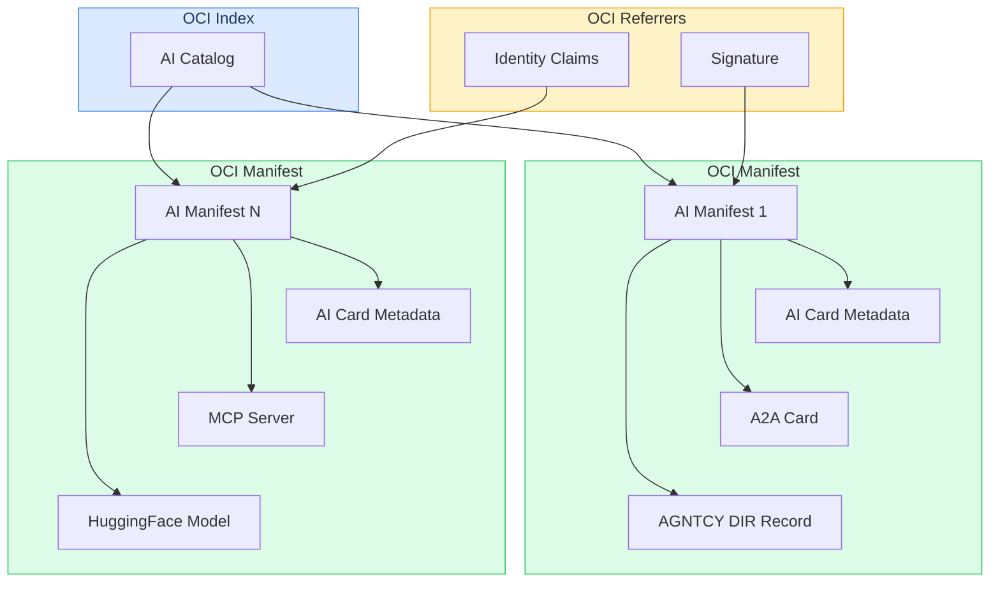

# AI Manifest Specification

**Version**: 1.0
**Status**: Draft
**Authors**: AI Card contributors

---

## Abstract

This specification defines an OCI-native format for representing, publishing and distributing AI Cards. AI Manifest is an AI Card packaged as an OCI Image Manifest that carries common AI agent metadata and delegates protocol-specific details as layers to enable modular composition. The AI Catalog is a collection of AI Cards, represented as an OCI Image Index, that aggregates AI Manifests for discovery. The specification also defines application-layer support focusing on common use cases like signing and attestation using OCI Referrers API.

Refer to [examples](examples/README.md) for a simple reference implementation of the specification captured in this document.

---

## 1. Related Work

- **[CNCF ModelPack](https://github.com/modelpack/model-spec)** follows the OCI-native approach but targets AI models rather than AI agents and services to enable model usage and distribution through OCI.
- **[AGNTCY DIR](https://spec.dir.agntcy.org)** follows the OCI-native approach and describes agents and their capabilities as OCI artifacts but focuses on discovery and routing between AI agents rather than their internals.

---

## 2. Conformance

The key words "MUST", "MUST NOT", "REQUIRED", "SHALL", "SHALL NOT", "SHOULD", "SHOULD NOT", "RECOMMENDED", "MAY", and "OPTIONAL" in this document are to be interpreted as described in [RFC 2119](https://www.rfc-editor.org/rfc/rfc2119).

An implementation is conformant with this specification if it satisfies the normative requirements applicable to its role (producer or consumer). 

---

## 3. Scope

This specification defines:

1. OCI Manifest structure for AI Card representation
2. Config Schema for common AI card metadata
3. Layer Schema for protocol cards, modules and dependencies
4. OCI Image Index structure for discovery
5. Application-layer support via OCI Referrers (e.g. signing and attestation)
6. Conformance levels for gradual adoption

This specification does not define protocol internals (for example, A2A skills or MCP capabilities). Layer content schemas are owned by their respective upstream projects.

---

## 4. Design Goals

1. AI Manifests are first-class OCI artifacts
2. Protocols are autonomous: each protocol project owns its own artifact schema and versioning
3. Discovery served through OCI Distribution API
4. Signing and attestation are handled entirely via OCI Referrers
5. Content integrity is guaranteed by OCI content-addressable digests
6. Modularity and extensibility without circular dependencies or breaking changes

---

## 5. Data Model

The data model can be expressed using a MerkleDAG:
- AI Manifest is a node linking common AI card metadata with protocol-specific layers
- AI Catalog is a node that aggregates multiple AI Manifests for discovery
- Referrers are nodes linking external data to AI Manifests for application-layer logic



### 5.1 AI Manifest

An AI Manifest is a standard OCI Image Manifest. The following fields are normative:

- `schemaVersion`: MUST be `2`
- `mediaType`: MUST be `application/vnd.oci.image.manifest.v1+json`
- `artifactType`: MUST be `application/vnd.aaif.ai.manifest.v1+json`
- `config`: MUST be a non-empty descriptor pointing to a blob with common AI card metadata
  - `mediaType`: MUST be `application/vnd.aaif.ai.card.metadata.v1+json`
- `layers`: zero or more layer descriptors that link protocol cards, modules and dependencies
  - `annotations`: MAY be used for extra metadata about the layer (e.g. A2A protocols, streaming support, etc)
  - `artifactType`: MAY be one of:
    - `application/vnd.a2a.card.v1+json`: A2A protocol card
    - `application/vnd.mcp.card.v1+json`: MCP protocol card
    - `application/vnd.agntcy.dir.record.v1+json`: AGNTCY DIR discovery and routing record
    - `application/vnd.cncf.model.manifest.v1+json`: ModelPack OCI Manifest
    - any other relevant type (e.g. identity verification blob, score metrics, etc)
- `annotations`: MUST include:
  - `org.aaif.ai.card.id`: globally unique URI identifying the subject
  - `org.aaif.ai.card.specVersion`: the version of this specification, e.g. `"1.0"`
- `subject`: MAY be used to link a common subject to enable autodiscovery (see *Section 6.3*)

Example:

```json
{
  "schemaVersion": 2,
  "mediaType": "application/vnd.oci.image.manifest.v1+json",
  "artifactType": "application/vnd.aaif.ai.manifest.v1+json",
  "config": {
    "mediaType": "application/vnd.aaif.ai.card.metadata.v1+json",
    "digest": "sha256:<card-blob-digest>",
    "size": 1234
  },
  "layers": [
    {
      "artifactType": "application/vnd.a2a.card.v1+json", // A2A card
      "digest": "sha256:<a2a-layer-digest>",
      "size": 567
    },
    {
      "artifactType": "application/vnd.mcp.card.v1+json", // MCP card
      "digest": "sha256:<mcp-layer-digest>",
      "size": 890
    },
    {
      "artifactType": "application/vnd.agntcy.dir.record.v1+json", // AGNTCY DIR record
      "digest": "sha256:<dir-record-digest>",
      "size": 890
    },
    {
      "artifactType": "application/vnd.cncf.model.manifest.v1+json", // Model dependency
      "mediaType": "application/vnd.oci.image.manifest.v1+json",
      "digest": "sha256:<model-manifest-digest>",
      "size": 92841
    },
    {
      "artifactType": "application/vnd.aaif.ai.manifest.v1+json", // AI Card dependency
      "mediaType": "application/vnd.oci.image.manifest.v1+json",
      "digest": "sha256:<card-manifest-digest>",
      "size": 320
    }
  ],
  "annotations": {
    "org.aaif.ai.card.id": "did:example:agent-finance-001",
    "org.aaif.ai.card.specVersion": "1.0",
    "org.opencontainers.image.title": "Acme Finance Agent",
    "org.opencontainers.image.description": "Executes finance workflows through multiple protocol adapters.",
    "org.opencontainers.image.created": "2026-02-22T16:00:00Z",
    "org.opencontainers.image.version": "2026.02.22",
    "org.opencontainers.image.vendor": "Acme Financial Corp"
  }
}
```

### 5.2 AI Card Metadata Config Blob

The config blob has mediaType `application/vnd.aaif.ai.card.metadata.v1+json` and carries common AI card metadata like identity and publisher information. 

The config blob MUST include:

- `id`: globally unique URI for the subject, such as a DID or URN. MUST match `org.aaif.ai.card.id` in the manifest annotations (see *Section 8*)
- `name`: human-readable name
- `description`: concise description
- `publisher.id`: globally unique publisher URI
- `publisher.name`: human-readable publisher name

The config blob MAY include:

- `logoUrl`: URI pointing to a logo image for the AI card
- `tags`: array of keywords describing the AI card

Example:

```json
{
  "id": "did:example:agent-finance-001",
  "name": "Acme Finance Agent",
  "description": "Executes finance workflows through multiple protocol adapters.",
  "logoUrl": "https://acme-finance.com/logo.png",
  "tags": ["finance", "trading"],
  "publisher": {
    "id": "did:example:org-acme",
    "name": "Acme Financial Corp"
  }
}
```

### 5.3 AI Manifest Layers

Each layer is a content-addressable blob or manifest stored separately. The content schema for each layer type is defined and owned by the respective upstream project. This specification defines only the artifactType identifier and the governing project reference.

- A2A Layer (`application/vnd.a2a.card.v1+json`): Content is an A2A agent card JSON document as defined by the [A2A specification](https://github.com/a2aproject/A2A).
- MCP Layer (`application/vnd.mcp.card.v1+json`): Content is an MCP server info document as defined by the [Model Context Protocol specification](https://spec.modelcontextprotocol.io).
- AGNTCY Layer (`application/vnd.agntcy.dir.record.v1+json`): Content is an AGNTCY DIR record document defined by the [AGNTCY DIR specification](https://spec.dir.agntcy.org/).
- Dataset Manifest (`application/vnd.cncf.model.manifest.v1+json`): Content is an OCI Manifest as defined by the [CNCF ModelPack specification](https://github.com/modelpack/model-spec).

### 5.4 AI Catalog

An AI Catalog is a standard OCI Image Index with:

- `schemaVersion`: MUST be `2`
- `mediaType`: MUST be `application/vnd.oci.image.index.v1+json`
- `artifactType`: MUST be `application/vnd.aaif.ai.catalog.v1+json`
- `manifests`: list of OCI descriptor entries for AI Manifests
  - `artifactType`: MUST be `application/vnd.aaif.ai.manifest.v1+json`
  - `annotations`: SHOULD include:
    - `org.aaif.ai.card.id`: subject identifier
- `annotations`: MAY include OCI annotations for catalog-level metadata

Example:

```json
{
  "schemaVersion": 2,
  "mediaType": "application/vnd.oci.image.index.v1+json",
  "artifactType": "application/vnd.aaif.ai.catalog.v1+json",
  "manifests": [
    {
      "mediaType": "application/vnd.oci.image.manifest.v1+json",
      "artifactType": "application/vnd.aaif.ai.manifest.v1+json",
      "digest": "sha256:<manifest-digest>",
      "size": 1234,
      "annotations": {
        "org.opencontainers.image.title": "Acme Finance Agent",
        "org.opencontainers.image.description": "Executes finance workflows through multiple protocol adapters.",
        "org.aaif.ai.card.id": "did:example:agent-finance-001"
      }
    }
  ],
  "annotations": {
    "org.opencontainers.image.title": "Acme Services Inc.",
    "org.opencontainers.image.created": "2026-02-22T16:00:00Z"
  }
}
```

---

## 6. Distribution

An AI Catalog MAY be served from any OCI-compliant registry or a statically hosted registry at `/.well-known/ai-registry`. Consumers MAY fetch the catalog, enumerate available AI Manifests, and retrieve individual manifests and blobs as needed.

The registry MUST support the following subset of the [OCI Distribution Specification](https://github.com/opencontainers/distribution-spec) read endpoints:

| Method | Full Path | Description |
|---|---|---|
| `GET` | `/.well-known/ai-registry` | Version check - return `{}` with `200 OK` |
| `GET` | `/.well-known/ai-registry/_catalog.json` | List available repository names (AI Catalogs) |
| `GET` / `HEAD` | `/.well-known/ai-registry/<name>/blobs/<digest>` | Fetch or check a blob by digest |
| `GET` / `HEAD` | `/.well-known/ai-registry/<name>/manifests/<reference>` | Fetch or check a manifest by tag or digest |
| `GET` | `/.well-known/ai-registry/<name>/tags/list` | List available tags |
| `GET` | `/.well-known/ai-registry/<name>/referrers/<digest>` | List referrers for a given digest |
| `GET` | `/.well-known/ai-registry/<name>/referrers/<digest>?artifactType=<type>` | Filtered referrer listing |

#### 6.1 Publication Workflow

Producers MUST be able to publish AI Manifests to any OCI-compliant registry (local filesystem or remote webserver) using the OCI Distribution Specification. Publication workflow MAY be private or public depending on the access controls defined by the registry owner.

**Publication workflow:**

1. Push each layer blob/manifest to the registry
2. Push the AI Manifest referencing layer descriptors by digest
3. Optionally push an AI Catalog (OCI Image Index) referencing multiple AI Manifests

#### 6.2 Discovery Workflow

Consumers MUST be able to discover and retrieve AI Manifests using the OCI Distribution Specification.

**Discovery workflow:**

1. Fetch `GET /.well-known/ai-registry/_catalog.json` to obtain the list of repository names
2. For each repository `<name>`, fetch `GET /.well-known/ai-registry/<name>/tags/list` to enumerate available tags
3. For each tag, fetch `GET /.well-known/ai-registry/<name>/manifests/<tag>` to retrieve the AI Manifes
4. For each AI Manifest, resolve config and layer data via matching endpoint by fetching blobs and manifests
5. For each AI Manifest, resolve links such as signatures and attestations via `GET /.well-known/ai-registry/<name>/referrers/<digest>`

### 6.3 Autodiscovery Workflow

The AI Manifest `subject` field MAY be used to link a common subject across multiple manifests to enable autodiscovery. Producers MAY use an empty manifest descriptor as the subject field in the AI Manifest to make it auto-discoverable without relying on an AI Catalog. Consumers MAY query the OCI Referrers API using the constant subject descriptor to discover all AI Manifests associated with the subject.

```
// Push an AI Manifest with a common subject descriptor for auto-discovery
{
  // ... AI manifest data ...
  "subject": {
      "mediaType": "application/vnd.oci.image.manifest.v1+json",
      "digest": "sha256:ca3d163bab055381827226140568f3bef7eaac187cebd76878e0b63e9e442356",
      "size": 3
  }
}

// Get all AI Manifests on the remote that registered for auto-discovery
GET /.well-known/ai-registry/<name>/referrers/sha256:ca3d163bab055381827226140568f3bef7eaac187cebd76878e0b63e9e442356
```

---

## 7. Application Layer Support

Application layer support SHOULD be possible outside AI Manifest payload using the OCI Referrers API. This enables creation of dynamic associations of application data with existing AI Manifests without modifying the original manifest or its digest.

### 7.1 Signing and Verification

Signatures MUST be attached to AI Manifests as OCI Referrers. This eliminates embedded `signatures` arrays and circular digest dependencies. Tools like Cosign and Notation can be used to sign and verify AI Manifests.

**Signing workflow:**

```
# Using Cosign
cosign sign registry.example.com/ai/finance-agent@sha256:<digest>

# Using Notation
notation sign registry.example.com/ai/finance-agent@sha256:<digest>
```

**Verification workflow:**

```
# Using Cosign
cosign verify registry.example.com/ai/finance-agent@sha256:<digest>

# Using Notation
notation verify registry.example.com/ai/finance-agent@sha256:<digest>
```

### 7.2 Attestations and Provenance

Producers MAY attach SLSA provenance, SBOMs, or in-toto attestations as referrers:

```
cosign attest --predicate slsa-provenance.json --type slsaprovenance \
  registry.example.com/ai/finance-agent@sha256:<digest>
```

---

## 8. Identifier Requirements

1. `org.aaif.ai.card.id` in manifest annotations and `id` in the config blob MUST be identical
2. `id` MUST be a URI and SHOULD use decentralized or domain-anchored schemes (e.g. `did:` or `urn:`)
3. The identifier namespace SHOULD be verifiable by a trust mechanism appropriate to the scheme
4. `id` is a stable logical name for the subject. It is distinct from an identity credential that proves control
5. OCI content-addressable digests provide immutable content integrity; `id` provides stable logical identity

---

## 9. Conformance

Implementations are classified by conformance level. Each level is cumulative.

- **L0-Base**: Produces or consumes a valid OCI manifest with a valid AI Card Config blob. No layers required
- **L1-Discovery**: L0 + publishes to an OCI registry or serves a registry at `/.well-known/ai-registry`
- **L2-Signed**: L1 + attaches a cosign or notation signature via the OCI Referrers API
- **L3-Attested**: L2 + attaches provenance or SBOM referrers (SLSA, in-toto, etc)

---

## 10. Schemas and Examples

CDDL definitions:

- `cddl/ai-card-metadata.cddl` - AI Card Metadata CDDL
- `cddl/ai-manifest.cddl` - AI Manifest CDDL
- `cddl/ai-catalog.cddl` - AI Catalog CDDL
