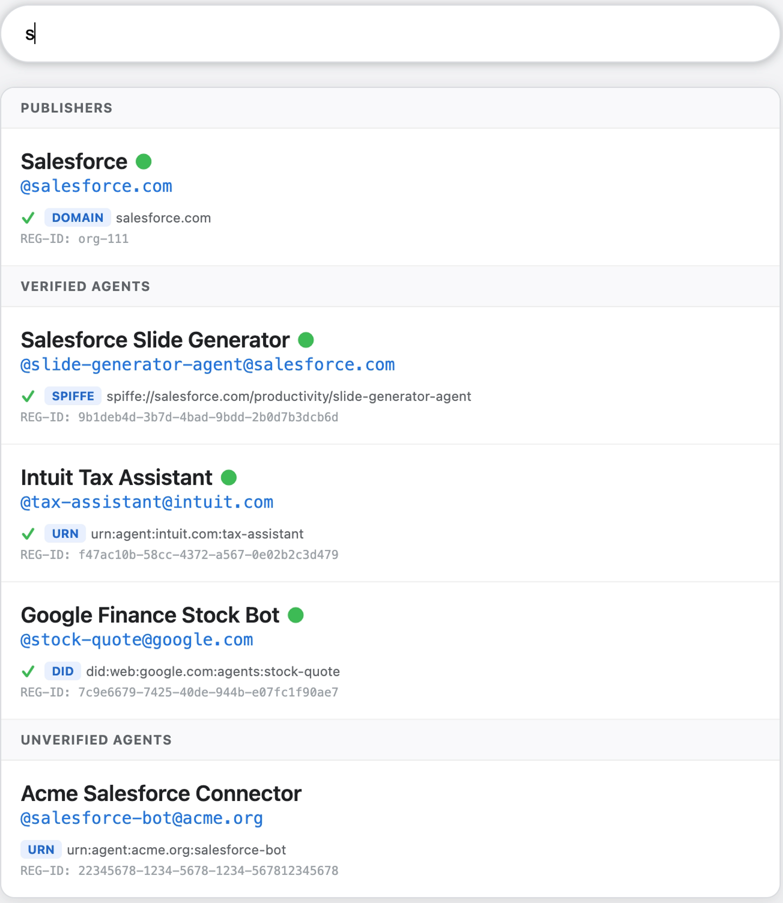

# **AI Actor Naming Standard**

## **1\. Abstract**

As AI agents move beyond monolithic endpoints and begin interacting across organizational boundaries, the ecosystem requires standardized protocols for naming, discovering, and verifying these actors.

This specification proposes a standardized, secure, multi-layer naming protocol for AI actors to ensure interoperability, discovery, and auditability. The core of the proposal relies on essential fields that separate the system's permanent logical handle from its human-readable display.

## **2\. Motivation**

The AI ecosystem currently lacks robust, secure standards for discovering and configuring AI actors. As agents move beyond monolithic endpoints, we require standardized protocols for naming, metadata documentation ("Cards"), and federated discovery to ensure interoperability across domains.

By separating the **Logical Name** (Agent Identifier) from the **Security Principal** (Verifiable Identity), this standard provides a resilient framework for reliable discovery even if underlying hosting infrastructures change.

## **3\. Core Agent Naming Fields**

An agent's name in a registry or AI Card is defined by these core fields, which separate the system's permanent, verifiable authority from human display.

| Field Name | Conceptual Name | Type | Description / Format |
| :---- | :---- | :---- | :---- |
| identifier | **Agent Identifier** | string | **Logical Name / Handle:** A globally unique, stable logical address. It MUST follow the URN convention (e.g., urn:agent:google:tax-bot). |
| displayName | **Short Name** | string | **Discovery:** A human-readable name (e.g., "Google Tax Bot"). This may be empty or repeated across different agents. |

*Note: The identifier (Agent Identifier) is fundamentally different from the agent's identity field, which represents the Security Principal (Verifiable authority). See Section 7 for details.*

## **4\. The Mock UI Stack (Concept Illustration)**

To illustrate how these fields map to a user interface during discovery, the system presents a multi-layered visual stack.

In a discovery dropdown or catalog, an agent is represented with its **Display Name** prominently at the top, followed by a **Search Handle** (derived from the URN), and its verified **Agent Identifier**.

This example below demonstrates how the agent structure maps to the hierarchical UI segments:

| UI Segment | Example Value | Description |
| :---- | :---- | :---- |
| **Display Name** | Salesforce Slide Generator Agent | The specific human-readable name of the agent (mapped from displayName). |
| **Search Handle** | @slide-generator-agent@salesforce.com | A user-friendly, searchable shorthand derived from the identifier. |
| **Agent Identifier** | urn:agent:salesforce.com:productivity:slide-generator | The globally unique, searchable logical address (mapped from identifier). |

## **5\. Agent Identifier Specification (identifier)**

The identifier is a single, globally unique logical handle that is immutable and shared across all consumers. It acts as the stable address that developers use to "call" or "reference" the agent.

### **5.1. URN Format**

The identifier MUST follow the URN format to establish clear domain authority and namespace hierarchy:

**Format:** urn:agent:\<publisher-domain\>:\<namespace\>:\<agent-name\>

* **urn**: The fixed prefix required by IETF RFC 8141\.  
* **agent**: The Namespace Identifier (NID). Other collections in the registry may use different NIDs (e.g., mcp, interactions).  
* **\<publisher-domain\>**: The Namespace Specific String (NSS). This MUST be the verifiable DNS domain where the agent is hosted (e.g., google.com).  
* **\<namespace\>**: Optional hierarchical segments (e.g., department, subcategory). Multiple components MUST be separated by :.  
* **\<agent-name\>**: Mandatory. The specific, stable name of the agent. The last segment of the URN is always the name.

### **5.2. Examples**

* urn:agent:salesforce.com:productivity:slide-generator  
* urn:agent:intuit.com:finance:tax-bot  
* urn:agent:acme.org:public:search-assistant

## **6\. Search & Discovery (The @ Pattern)**

Registries and Discovery Engines SHOULD utilize a tiered indexing strategy that interprets an @ trigger to search both human labels and verified authorities.

### **6.1. The Resolution Engine**

To facilitate intuitive discovery in User Interfaces (UIs) and developer consoles, the system uses the @ pattern:

* **Organizational Search (@Domain or Publisher):** Inputting @Salesforce queries the Publisher Handle (parsed from the domain of the URN).  
* **Agent Search (AgentName@Domain):** Inputting Tax@Salesforce scopes the search to the verified Salesforce domain and matches the Short Name (the terminal path of the ID).

### **6.2. Conflict Resolution**

If a third-party developer names their agent "Salesforce", the UI resolves conflicts through Domain Authority:

* If an agent is named "Salesforce" but owned by "Acme," it appears in search results as Acme@Salesforce.  
* The real company appears as Acme with a **Verified Shield**, preventing impersonation via the displayName.

## **7\. Limitations: Distinguishing Naming from Security Identity**

A critical design consideration of this standard is the explicit separation of **Naming** from **Identity**.

While the identifier (urn:agent:...) provides a stable logical name, it does not act as the cryptographic badge during runtime execution. Runtime security relies on distinct Agent Identity fields:

* **identity**: (Security) The Verifiable URI (e.g., spiffe://google.com/workload/tax or did:web:...).  
* **identityType**: (Metadata) The type of verification (e.g., SPIFFE, DID, HTTP).

**Agent Identity Verification:**

During execution, consumers depend on the identity field. An Agent Trust service will run the cryptographic verification process (e.g., an mTLS handshake using the SPIFFE SVID) against the identity field, returning a verified status or badge. The identifier ensures you found the right agent; the identity proves the agent is who it claims to be.